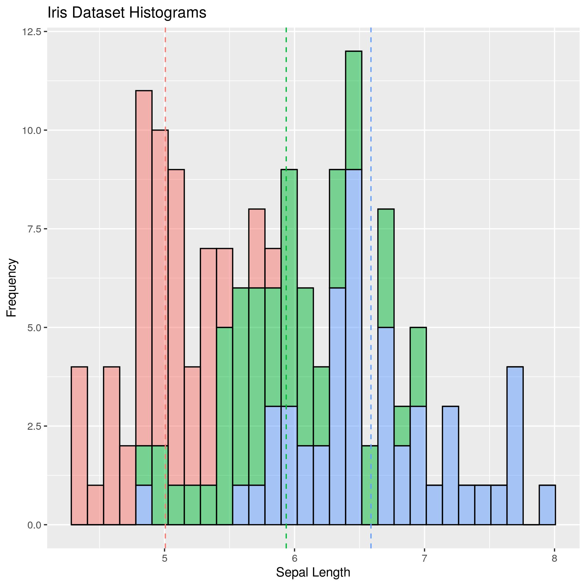
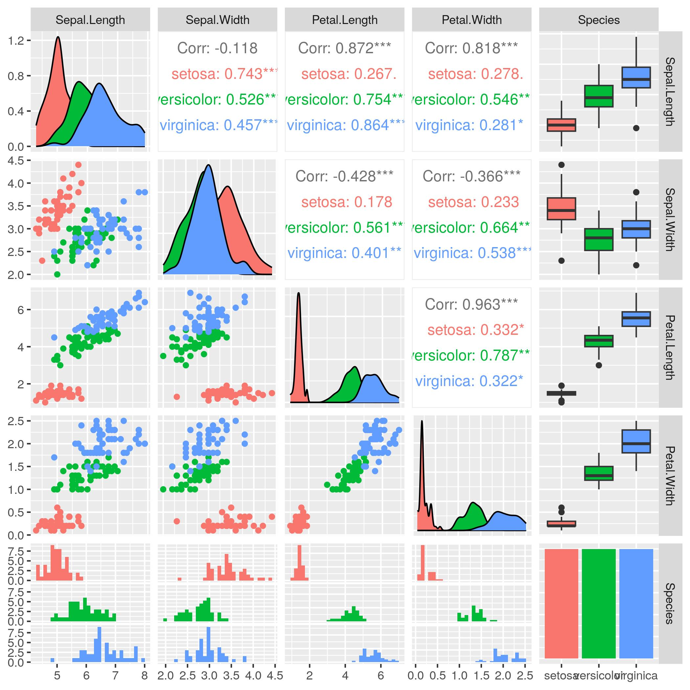
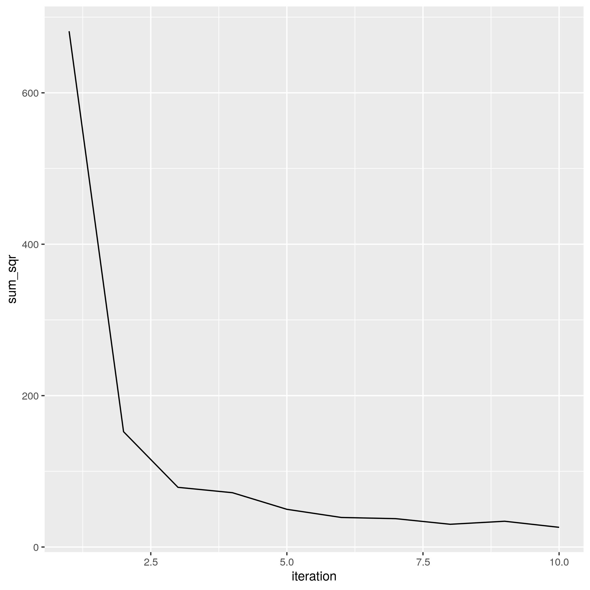
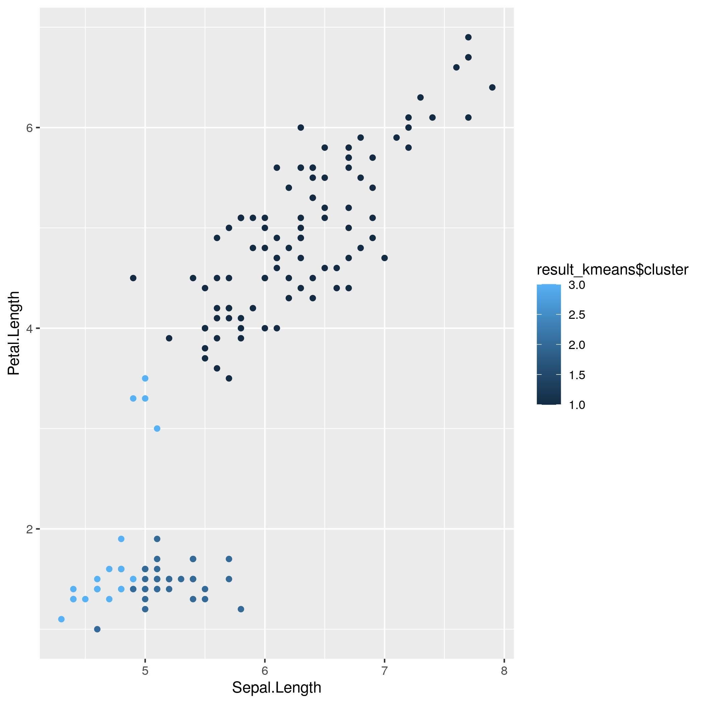
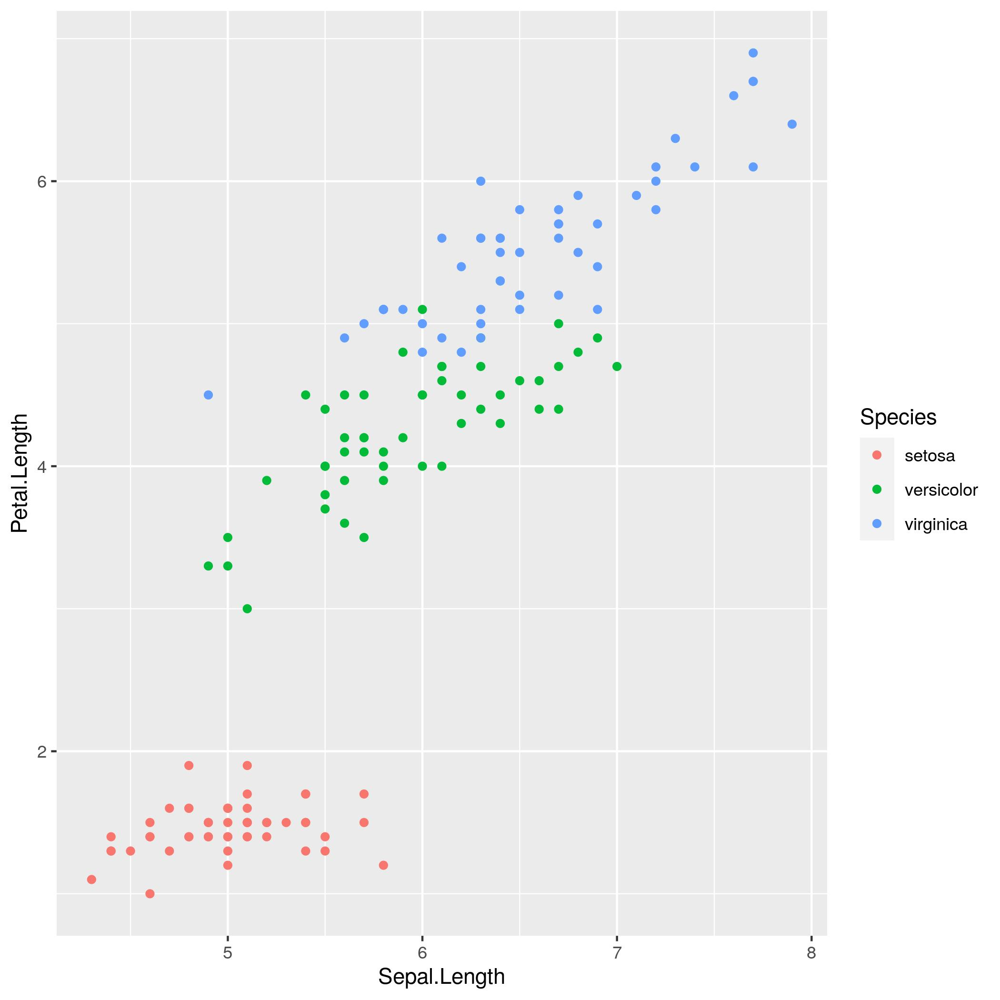

# LABORATORIUM NR 14:

## Wprowadzenie do R – clustering

Po zapoznaniu się z różnicami w składni i po instalacji środowiska do konteneryzacji Docker, przystąpiliśmy we dwójkę (współpracowałem z Jakubem Szczypkiem, ponieważ w jego przypadku pobranie Dockera nie powiodło się) do napisania skryptu w R. 

Skrypt wygenerował nam następujące wykresy:

1. **Histogram database'u IRIS zmiennej Sepal Length, odróżniając rodzaje irysów kolorami:**

2. **Ploty otrzymane za pomocą funkcji ggpairs() z biblioteki GGally:**

3. **Plot zależności pierwiastka sumy od iteracji:**

4. **Plot klastrów, które uzyskaliśmy wyliczając kmeans():**

5. **Plot klastrów, z podziałem na rodzaje kwiatów:**

Widać dużą zależność pomiędzy 4-tym i 5-tym wykresem, mimo iż wykorzystywaliśmy znacząco inne kryteria.

W pliku skrypt.r znajduje się kod z opisem, które zadanie z instrukcji jest nim realizowane.

### Piotr Suchy 407332 AiBD 19.01.2023